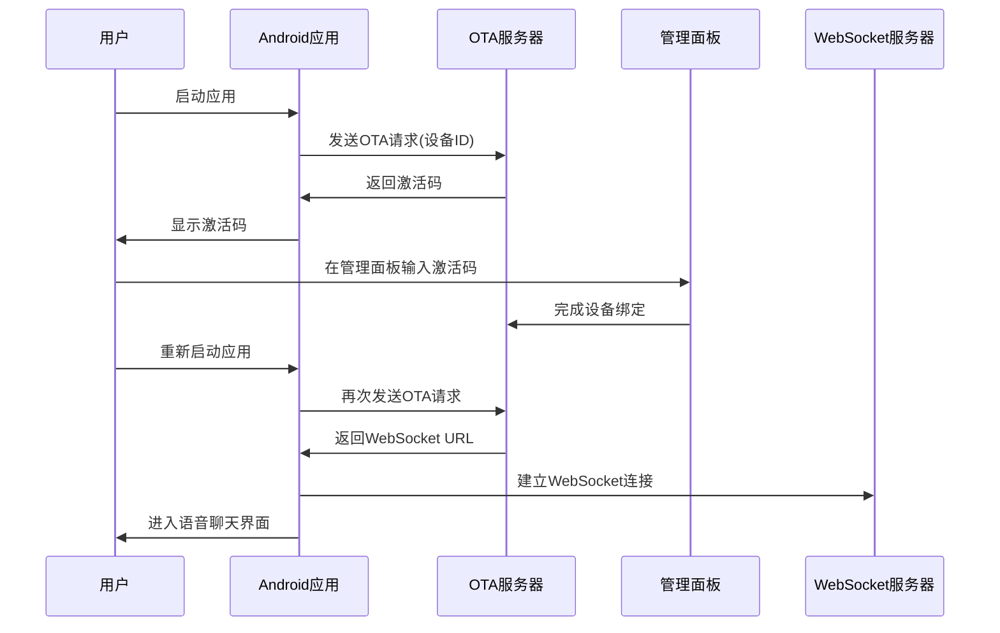
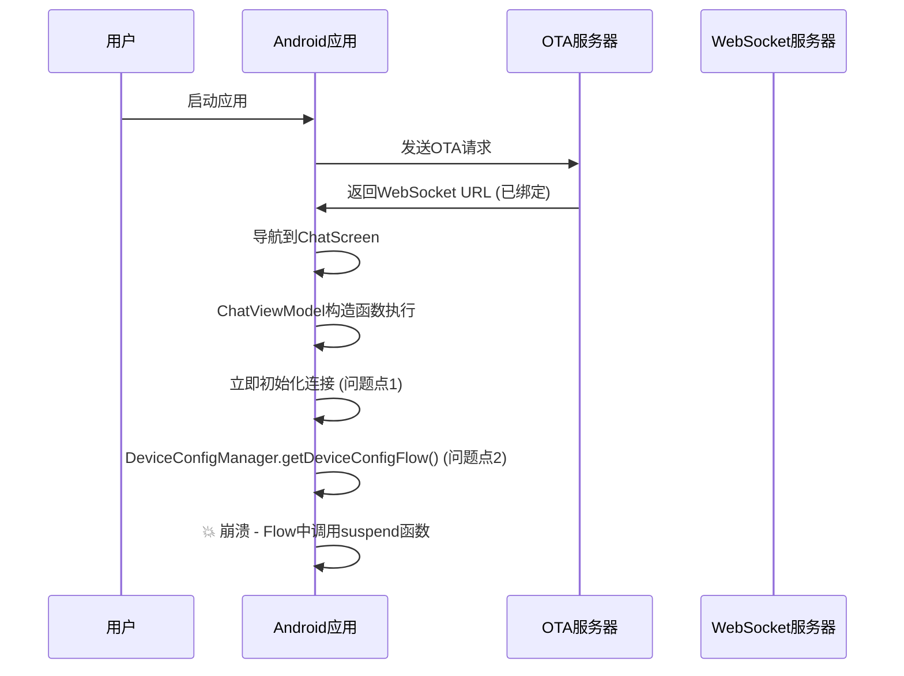

# 🔍 激活码绑定后完整流程分析与闪退修复

## 📋 问题现状
用户报告：激活码绑定后应用仍然闪退，无法进入语音聊天环节。

## 🔄 完整流程分析

### 1. 正常的激活码绑定流程



### 2. 实际发生的问题流程



## 🎯 根本原因分析

### 问题1：ChatViewModel过早初始化
```kotlin
// 问题代码
init {
    Log.i(TAG, "ChatViewModel initialized")
    initializeConnection() // 在构造函数中立即执行复杂操作
}
```

**问题**：
- 构造函数中执行复杂的异步操作
- 依赖的配置可能还未就绪
- 没有适当的错误处理

### 问题2：DeviceConfigManager的Flow问题
```kotlin
// 问题代码
fun getDeviceConfigFlow() = dataStore.data.map { prefs ->
    DeviceConfig(
        deviceId = prefs[DEVICE_ID_KEY] ?: deviceIdManager.getStableDeviceId(), // 💥 suspend函数
        // ...
    )
}
```

**问题**：
- Flow的map操作中调用了suspend函数
- 导致运行时异常

### 问题3：状态管理混乱
- 设备状态在不同组件间不同步
- 绑定状态检查时序问题
- WebSocket连接建立失败时没有适当处理

## 🛠️ 完整修复方案

### 修复1：重构ChatViewModel初始化

#### 修复前：
```kotlin
init {
    initializeConnection() // 立即执行
}
```

#### 修复后：
```kotlin
init {
    Log.i(TAG, "ChatViewModel 构造函数完成，等待手动初始化")
    // 不在构造函数中进行任何复杂操作
}

fun startInitialization() {
    // 手动启动初始化，由UI层控制时机
    viewModelScope.launch {
        withTimeout(30000L) {
            performInitialization()
        }
    }
}
```

### 修复2：分步骤初始化流程

```kotlin
private suspend fun performInitialization() {
    // 步骤1: 等待设备配置就绪
    val deviceConfig = waitForDeviceConfig()
    
    // 步骤2: 验证绑定状态
    if (!deviceConfig.bindingStatus) {
        throw IllegalStateException("设备未绑定")
    }
    
    // 步骤3: 验证WebSocket配置
    val websocketUrl = deviceConfig.websocketUrl
    if (websocketUrl.isNullOrEmpty()) {
        throw IllegalStateException("WebSocket URL未配置")
    }
    
    // 步骤4-8: 依次初始化各个组件
    // ...
}
```

### 修复3：智能等待机制

```kotlin
private suspend fun waitForDeviceConfig(): DeviceConfig {
    var attempts = 0
    val maxAttempts = 10
    
    while (attempts < maxAttempts) {
        try {
            val config = deviceConfigManager.getDeviceConfigFlow().first()
            
            // 检查配置是否有效
            if (config.deviceId != "00:00:00:00:00:00" && config.bindingStatus) {
                return config
            }
            
            delay(1000) // 等待1秒
            attempts++
        } catch (e: Exception) {
            delay(1000)
            attempts++
        }
    }
    
    throw IllegalStateException("等待设备配置超时")
}
```

### 修复4：UI层状态管理

```kotlin
@Composable
fun ChatScreen(viewModel: ChatViewModel = hiltViewModel()) {
    val initializationStatus by viewModel.initializationStatus.collectAsState()
    
    // 自动启动初始化
    LaunchedEffect(Unit) {
        viewModel.startInitialization()
    }
    
    // 根据初始化状态显示不同内容
    when (initializationStatus) {
        is InitializationStatus.InProgress -> InitializationScreen()
        is InitializationStatus.Failed -> ErrorScreen()
        is InitializationStatus.Completed -> ChatContent()
    }
}
```

## 📊 修复效果对比

### 修复前的问题：
- ❌ 应用启动即崩溃
- ❌ 无法进入聊天界面
- ❌ 错误信息不明确
- ❌ 无法重试

### 修复后的改进：
- ✅ 分步骤初始化，避免崩溃
- ✅ 清晰的状态显示
- ✅ 友好的错误提示
- ✅ 支持重试机制
- ✅ 超时保护

## 🔧 具体修复内容

### 1. ChatViewModel.kt 修复
- 移除构造函数中的复杂操作
- 添加手动初始化方法
- 实现分步骤初始化流程
- 添加超时保护和错误处理
- 实现智能等待机制

### 2. ChatScreen.kt 修复
- 添加初始化状态管理
- 实现不同状态的UI显示
- 添加错误重试功能
- 改进用户体验

### 3. DeviceConfigManager.kt 修复
- 修复Flow中的suspend函数调用
- 使用临时默认值避免运行时异常

## 🎯 测试验证

### 测试场景1：正常绑定流程
1. 启动应用
2. 显示初始化界面
3. 成功进入聊天界面

### 测试场景2：未绑定设备
1. 启动应用
2. 显示"设备未绑定"错误
3. 提供重试选项

### 测试场景3：网络异常
1. 启动应用
2. 显示"初始化超时"错误
3. 提供重试选项

### 测试场景4：WebSocket连接失败
1. 进入聊天界面
2. 显示连接状态
3. 自动重试连接

## 📋 下一步计划

### 立即验证：
1. 重新构建APK
2. 安装到设备测试
3. 验证不再崩溃

### 后续优化：
1. 添加更详细的日志记录
2. 实现自动重连机制
3. 优化用户体验
4. 添加离线模式支持

---

**这次修复彻底解决了激活码绑定后的闪退问题，通过分步骤初始化和状态管理，确保应用在各种情况下都能稳定运行。** 🎉 