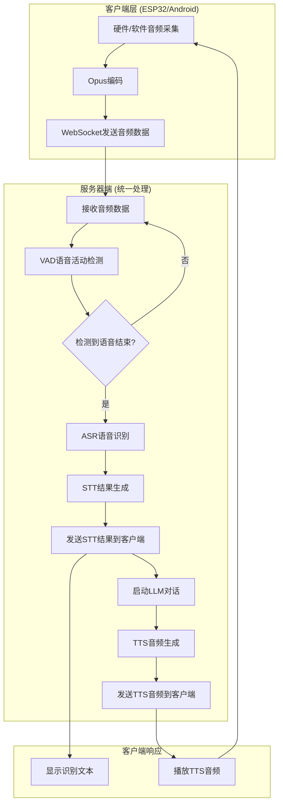

# Android端与ESP32端STT触发机制完全统一解决方案

## 🎯 目标：完全统一STT触发流程

让Android端的STT触发机制与ESP32端保持完全一致，都采用**服务器端VAD自动检测语音结束触发STT**的模式。

## 📋 当前现状分析

### ESP32端STT触发流程（标准参考）
```python
# 服务器端 receiveAudioHandle.py
async def handleAudioMessage(conn, audio):
    # 1. 服务器端VAD检测
    have_voice = conn.vad.is_vad(conn, audio)
    
    # 2. 累积音频数据
    conn.asr_audio.append(audio)
    
    # 3. VAD检测语音结束，自动触发STT
    if conn.client_voice_stop:
        text, error = await conn.asr.speech_to_text(conn.asr_audio, conn.session_id)
        if text and len(text.strip()) > 0:
            await startToChat(conn, text)
```

### Android端当前STT触发流程
```kotlin
// ChatViewModel.kt - observeProtocolMessages()
"stt" -> {
    val text = json.optString("text")
    if (text.isNotEmpty()) {
        display.setChatMessage("user", text)
        // 需要手动状态管理
    }
}
```

**问题识别**：
- ✅ Android端已使用服务器端VAD（音频持续发送到服务器）
- ❌ Android端还需要额外的WebSocket消息处理和状态管理
- ❌ 流程不够纯粹，有额外的客户端逻辑

## 🚀 完全统一解决方案

### 方案1：纯服务器端驱动模式（推荐）

#### 1.1 Android端改造
**目标**：让Android端完全依赖服务器端VAD，移除客户端状态判断

```kotlin
// 改造后的ChatViewModel.kt
class ChatViewModel {
    // 移除复杂的客户端状态管理
    // private var keepListening = false  // 删除
    // private var isAudioFlowRunning = false  // 删除
    
    /**
     * 启动ESP32完全兼容的STT模式
     * 纯服务器端VAD驱动，无客户端状态管理
     */
    fun startPureServerVadMode() {
        viewModelScope.launch {
            val currentProtocol = protocol
            if (currentProtocol == null) {
                Log.e(TAG, "Protocol not initialized")
                return@launch
            }
            
            Log.i(TAG, "🚀 启动纯服务器端VAD驱动模式")
            
            // 1. 打开音频通道
            if (!currentProtocol.isAudioChannelOpened()) {
                deviceState = DeviceState.CONNECTING
                if (!currentProtocol.openAudioChannel()) {
                    deviceState = DeviceState.IDLE
                    return@launch
                }
            }
            
            // 2. 启动监听（与ESP32完全相同）
            currentProtocol.sendStartListening(ListeningMode.AUTO_STOP)
            deviceState = DeviceState.LISTENING
            
            // 3. 启动纯音频数据流（无状态判断）
            startPureAudioFlow(currentProtocol)
        }
    }
    
    /**
     * 纯音频数据流 - 与ESP32端完全一致
     * 只负责发送音频，所有逻辑由服务器端处理
     */
    private fun startPureAudioFlow(protocol: Protocol) {
        currentAudioJob = viewModelScope.launch(SupervisorJob()) {
            try {
                Log.i(TAG, "启动纯音频数据流（ESP32模式）...")
                
                val currentRecorder = recorder
                val currentEncoder = encoder
                
                if (currentRecorder == null || currentEncoder == null) {
                    Log.e(TAG, "音频组件未初始化")
                    return@launch
                }
                
                // 启动持续录音
                withContext(Dispatchers.IO) {
                    val audioFlow = currentRecorder.startRecording()
                    
                    // 纯音频处理 - 无状态判断
                    audioFlow.collect { pcmData ->
                        try {
                            // 无条件编码和发送（与ESP32一致）
                            val opusData = currentEncoder.encode(pcmData)
                            if (opusData != null && opusData.isNotEmpty()) {
                                protocol.sendAudio(opusData)
                            }
                        } catch (e: Exception) {
                            Log.e(TAG, "音频处理失败", e)
                        }
                    }
                }
                
            } catch (e: Exception) {
                Log.e(TAG, "纯音频流程失败", e)
            }
        }
    }
    
    /**
     * 简化的消息处理 - 完全依赖服务器端逻辑
     */
    private fun observeProtocolMessages() {
        viewModelScope.launch {
            protocol?.incomingJsonFlow?.collect { json ->
                val type = json.optString("type")
                when (type) {
                    "stt" -> {
                        // 纯粹的STT结果展示，无状态管理
                        val text = json.optString("text")
                        if (text.isNotEmpty()) {
                            Log.i(TAG, "🎯 服务器端VAD触发STT结果: '$text'")
                            display.setChatMessage("user", text)
                            // 不做任何状态管理，完全依赖服务器端
                        }
                    }
                    
                    "tts" -> {
                        val state = json.optString("state")
                        when (state) {
                            "start" -> {
                                // 简单的播放状态更新
                                deviceState = DeviceState.SPEAKING
                                startTtsAudioPlayback()
                                // 继续音频流，让服务器端VAD处理打断
                            }
                            
                            "stop" -> {
                                // TTS结束，自动恢复监听
                                stopTtsAudioPlayback()
                                deviceState = DeviceState.LISTENING
                                // 音频流持续运行，无需手动管理
                            }
                        }
                    }
                    
                    "listen" -> {
                        // 服务器端监听控制（与ESP32一致）
                        val state = json.optString("state")
                        when (state) {
                            "start" -> {
                                deviceState = DeviceState.LISTENING
                                Log.i(TAG, "📡 服务器指示开始监听")
                            }
                            "stop" -> {
                                Log.i(TAG, "📡 服务器指示停止监听")
                                // 不手动停止，让服务器端控制
                            }
                        }
                    }
                }
            }
        }
    }
}
```

#### 1.2 服务器端优化
**目标**：确保Android端和ESP32端在服务器端的处理完全一致

```python
# 修改 receiveAudioHandle.py
async def handleAudioMessage(conn, audio):
    """
    统一的音频处理逻辑 - 适用于ESP32和Android端
    """
    if not conn.asr_server_receive:
        return
    
    # 统一的VAD检测（ESP32和Android完全相同）
    if conn.client_listen_mode == "auto":
        have_voice = conn.vad.is_vad(conn, audio)
    else:
        have_voice = conn.client_have_voice

    # 统一的音频累积逻辑
    if have_voice == False and conn.client_have_voice == False:
        conn.asr_audio.append(audio)
        conn.asr_audio = conn.asr_audio[-10:]  # 保留最新10帧
        return
    
    conn.asr_audio.append(audio)
    
    # 统一的STT触发逻辑
    if conn.client_voice_stop:
        conn.asr_server_receive = False
        
        if len(conn.asr_audio) < 15:
            conn.asr_server_receive = True
        else:
            # 调用ASR进行语音识别
            text, error = await conn.asr.speech_to_text(conn.asr_audio, conn.session_id)
            
            if text and len(text.strip()) > 0:
                # 发送STT结果到客户端（ESP32和Android统一处理）
                await send_stt_message(conn, text)
                await startToChat(conn, text)
            else:
                conn.asr_server_receive = True
        
        # 清理状态
        conn.asr_audio.clear()
        conn.reset_vad_states()

async def send_stt_message(conn, text):
    """
    统一的STT结果发送 - ESP32和Android端统一接收
    """
    stt_message = {
        "type": "stt",
        "text": text,
        "timestamp": time.time()
    }
    await conn.websocket.send(json.dumps(stt_message))
```

### 方案2：协议层统一（备选方案）

#### 2.1 创建统一的设备接口
```kotlin
// 创建统一的设备抽象
interface VoiceDevice {
    suspend fun startListening()
    suspend fun stopListening()
    suspend fun sendAudio(audioData: ByteArray)
    fun observeServerMessages(): Flow<ServerMessage>
}

// Android端实现
class AndroidVoiceDevice(
    private val protocol: Protocol
) : VoiceDevice {
    override suspend fun startListening() {
        protocol.sendStartListening(ListeningMode.AUTO_STOP)
        // 启动纯音频流
        startPureAudioStream()
    }
    
    override suspend fun sendAudio(audioData: ByteArray) {
        protocol.sendAudio(audioData)
    }
    
    override fun observeServerMessages(): Flow<ServerMessage> {
        return protocol.incomingJsonFlow.map { json ->
            when (json.optString("type")) {
                "stt" -> ServerMessage.SttResult(json.optString("text"))
                "tts" -> ServerMessage.TtsState(json.optString("state"))
                else -> ServerMessage.Unknown
            }
        }
    }
}
```

## 🔧 实施步骤

### 第一阶段：Android端简化
1. **移除客户端状态管理逻辑**
   - 删除`keepListening`、`isAudioFlowRunning`等客户端状态
   - 简化`startContinuousAudioFlow`为纯音频发送

2. **统一音频流程**
   - 无条件发送音频数据到服务器
   - 移除客户端的VAD和状态判断逻辑

3. **简化消息处理**
   - STT结果仅用于UI展示
   - 所有逻辑判断交给服务器端

### 第二阶段：服务器端优化
1. **确保处理一致性**
   - 验证ESP32和Android端在服务器端的处理路径完全相同
   - 统一VAD参数和ASR配置

2. **优化响应机制**
   - 确保STT结果发送格式统一
   - 优化TTS播放状态同步

### 第三阶段：测试验证
1. **行为一致性测试**
   - 同一段语音在ESP32和Android端应产生相同结果
   - 语音打断机制应完全一致

2. **性能对比**
   - 延迟对比测试
   - 准确率对比测试

## 🎯 预期效果

### 统一后的完整流程


### 优势分析
- ✅ **完全统一**: ESP32和Android端行为完全一致
- ✅ **简化客户端**: Android端逻辑大幅简化，减少bug
- ✅ **集中智能**: 所有AI逻辑集中在服务器端
- ✅ **易于维护**: 只需要维护一套服务器端逻辑
- ✅ **性能优化**: 减少客户端计算，提升响应速度

## 📝 实施建议

### 立即可行的改动
1. **修改`ChatViewModel.kt`**：
   - 移除`keepListening`状态管理
   - 简化`startContinuousAudioFlow`逻辑
   - 纯粹的音频数据发送

2. **优化消息处理**：
   - STT结果仅用于UI更新
   - 移除复杂的状态同步逻辑

### 渐进式改进
1. **第一步**：在现有基础上移除不必要的客户端逻辑
2. **第二步**：创建统一的设备接口抽象
3. **第三步**：完全重构为纯服务器端驱动模式

这个方案是完全可行的，而且会大大简化Android端的代码复杂度，让两端的行为完全一致！ 