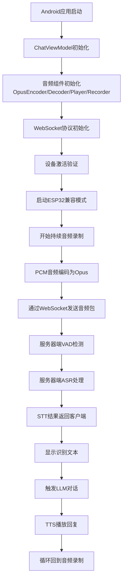
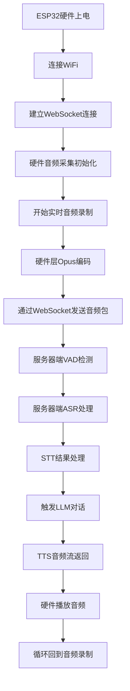

# Android端与ESP32端STT流程深度对比分析

## 📋 概述对比

| 维度 | Android端 | ESP32端 |
|------|-----------|---------|
| **处理位置** | 客户端音频采集 + 服务器端STT | 硬件音频采集 + 服务器端STT |
| **架构模式** | 软件实现的WebSocket客户端 | 硬件设备WebSocket客户端 |
| **计算资源** | 利用手机CPU/内存资源 | 最小化资源消耗，依赖服务器 |
| **实现语言** | Kotlin (Android) | C++ (ESP32固件) |

## 🔄 STT工作流程对比

### 1. 整体流程对比

#### Android端STT流程


#### ESP32端STT流程


### 2. 音频采集对比

#### Android端音频采集
**实现位置**: `ChatViewModel.kt` + `AudioRecorder.kt`

**技术特点**:
```kotlin
// Android端音频录制流程
private fun startContinuousAudioFlow(protocol: Protocol) {
    currentAudioJob = viewModelScope.launch(SupervisorJob()) {
        isAudioFlowRunning = true
        
        val currentRecorder = recorder
        val currentEncoder = encoder
        
        // 启动录音
        val audioFlow = currentRecorder.startRecording()
        
        // 处理音频数据流
        audioFlow.collect { pcmData ->
            // 检查设备状态 (LISTENING/SPEAKING都发送)
            if (deviceState == DeviceState.LISTENING || deviceState == DeviceState.SPEAKING) {
                // Opus编码
                val opusData = currentEncoder.encode(pcmData)
                // WebSocket发送
                protocol.sendAudio(opusData)
            }
        }
    }
}
```

**特点分析**:
- ✅ **协程异步处理**: 使用Kotlin协程避免阻塞UI线程
- ✅ **状态管理**: 精细的设备状态控制(LISTENING/SPEAKING/IDLE)
- ✅ **错误处理**: 完善的异常捕获和恢复机制
- ✅ **内存管理**: 定期垃圾回收，防止内存泄漏
- ✅ **智能音频流**: 在TTS播放时继续发送音频支持打断

#### ESP32端音频采集
**实现位置**: ESP32固件中的音频驱动

**技术特点**:
```cpp
// ESP32端音频采集 (伪代码示例)
void audio_capture_task() {
    while(running) {
        // 硬件I2S音频采集
        size_t bytes_read = 0;
        i2s_read(I2S_PORT, audio_buffer, BUFFER_SIZE, &bytes_read, portMAX_DELAY);
        
        // 硬件Opus编码
        opus_encode_frame(audio_buffer, opus_buffer);
        
        // WebSocket发送
        websocket_send_binary(opus_buffer, opus_size);
        
        // 低延迟处理
        vTaskDelay(pdMS_TO_TICKS(FRAME_DURATION_MS));
    }
}
```

**特点分析**:
- ✅ **硬件优化**: 直接I2S音频接口，低延迟
- ✅ **资源精简**: 最小内存占用，适合嵌入式设备
- ✅ **实时性强**: 硬件级别的音频处理
- ✅ **功耗优化**: 低功耗设计，适合长时间运行
- ⚠️ **功能简单**: 相对简单的错误处理和状态管理

### 3. STT触发机制对比

#### Android端STT触发
**位置**: `ChatViewModel.kt` - `observeProtocolMessages()`

```kotlin
// STT结果处理
"stt" -> {
    val text = json.optString("text")
    if (text.isNotEmpty()) {
        Log.i(TAG, "🎯 STT识别结果: '$text'")
        display.setChatMessage("user", text)
        
        // ESP32兼容：STT识别后等待服务器TTS响应
        if (keepListening && deviceState == DeviceState.LISTENING) {
            Log.i(TAG, "📝 ESP32兼容模式：STT识别完成，等待服务器TTS响应...")
        }
    }
}
```

**触发特点**:
- 🔄 **服务器主导**: STT结果由服务器端WebSocket消息触发
- 📱 **UI更新**: 立即更新聊天界面显示识别结果
- 🔄 **状态维护**: 保持keepListening状态等待TTS响应
- ⚡ **智能响应**: 可以处理复杂的多轮对话状态

#### ESP32端STT触发
**位置**: 服务器端 `receiveAudioHandle.py`

```python
# ESP32端STT触发流程
async def handleAudioMessage(conn, audio):
    # VAD语音活动检测
    have_voice = conn.vad.is_vad(conn, audio)
    
    # 累积音频数据
    conn.asr_audio.append(audio)
    
    # 检测语音结束，触发STT
    if conn.client_voice_stop:
        # 调用ASR进行语音识别
        text, error = await conn.asr.speech_to_text(conn.asr_audio, conn.session_id)
        
        if text and len(text.strip()) > 0:
            # 启动对话流程
            await startToChat(conn, text)
```

**触发特点**:
- 🎯 **VAD自动触发**: 基于Silero VAD模型自动检测语音结束
- ⚡ **低延迟处理**: 硬件到服务器直接处理，减少中间环节
- 🔄 **简单状态**: 相对简单的状态管理机制
- 🚀 **高效处理**: 服务器端集中处理，减少设备负担

### 4. 语音打断机制对比

#### Android端语音打断
**实现**: TTS播放期间继续音频流

```kotlin
// TTS状态处理
"start" -> {
    deviceState = DeviceState.SPEAKING
    startTtsAudioPlayback()
    
    // ESP32兼容：TTS播放时继续音频发送以支持语音打断
    if (keepListening) {
        Log.i(TAG, "🎤 TTS播放中继续音频监测，支持语音打断")
        // 不改变isAudioFlowRunning状态，让音频流程继续运行
    }
}
```

**打断特点**:
- 🎯 **双状态处理**: SPEAKING状态下依然发送音频数据
- 🔄 **服务器VAD**: 依赖服务器端VAD检测用户说话
- ⚡ **即时响应**: 检测到语音立即停止TTS播放
- 🎛️ **状态同步**: 客户端和服务器状态实时同步

#### ESP32端语音打断
**实现**: 硬件持续音频发送 + 服务器VAD

```python
# 服务器端VAD检测（支持ESP32和Android）
def is_vad(self, conn, opus_packet):
    # Opus解码为PCM
    pcm_frame = self.decoder.decode(opus_packet, 960)
    
    # VAD模型检测
    speech_prob = self.model(audio_tensor, 16000).item()
    client_have_voice = speech_prob >= self.vad_threshold
    
    # 语音结束检测
    if conn.client_have_voice and not client_have_voice:
        if stop_duration >= self.silence_threshold_ms:
            conn.client_voice_stop = True  # 触发STT处理
```

**打断特点**:
- 🎯 **硬件持续**: ESP32硬件持续发送音频数据
- 🧠 **服务器智能**: 服务器端Silero VAD统一处理
- ⚡ **极低延迟**: 硬件级别的音频采集和传输
- 🎛️ **统一标准**: 与Android端使用相同的服务器端逻辑

## 🔧 技术实现差异

### 1. 音频编解码对比

#### Android端音频编解码
```kotlin
// 初始化音频组件
private fun initializeAudioComponents() {
    val sampleRate = 16000
    val channels = 1
    val frameSizeMs = 60
    
    encoder = OpusEncoder(sampleRate, channels, frameSizeMs)
    decoder = OpusDecoder(sampleRate, channels, frameSizeMs)
    player = OpusStreamPlayer(sampleRate, channels, frameSizeMs)
    recorder = AudioRecorder(sampleRate, channels, frameSizeMs)
}

// 音频编码流程
val opusData = currentEncoder.encode(pcmData)
protocol.sendAudio(opusData)
```

#### ESP32端音频编解码
```cpp
// ESP32音频配置 (来自固件)
#define SAMPLE_RATE 16000
#define CHANNELS 1
#define FRAME_DURATION_MS 60

// 硬件编码 (伪代码)
opus_encoder_create(SAMPLE_RATE, CHANNELS, &encoder);
opus_encode(encoder, pcm_frame, frame_size, opus_packet, max_packet_size);
```

### 2. 网络通信对比

#### Android端WebSocket
```kotlin
// WebSocket协议初始化
protocol = WebsocketProtocol(deviceInfo!!, websocketUrl, accessToken)
protocol?.start()

// 消息监听
protocol?.incomingJsonFlow?.collect { json ->
    when (json.optString("type")) {
        "tts" -> handleTtsMessage(json)
        "stt" -> handleSttMessage(json)
        "listen" -> handleListenMessage(json)
    }
}
```

#### ESP32端WebSocket
```cpp
// WebSocket连接 (伪代码)
websocket_client_config_t config = {
    .uri = websocket_url,
    .cert_pem = NULL,
};

esp_websocket_client_handle_t client = esp_websocket_client_init(&config);
esp_websocket_register_events(client, WEBSOCKET_EVENT_ANY, websocket_event_handler, NULL);
esp_websocket_client_start(client);
```

### 3. 状态管理对比

#### Android端状态管理
```kotlin
enum class DeviceState {
    UNKNOWN,      // 未知状态
    STARTING,     // 启动中
    ACTIVATING,   // 激活中
    IDLE,         // 空闲
    CONNECTING,   // 连接中
    LISTENING,    // 监听中
    SPEAKING,     // 播放中
    FATAL_ERROR   // 致命错误
}

// 状态变更
var deviceState: DeviceState
    set(value) {
        Log.d(TAG, "设备状态变更: ${deviceStateFlow.value} -> $value")
        deviceStateFlow.value = value
    }
```

#### ESP32端状态管理
```cpp
// ESP32简化状态 (伪代码)
typedef enum {
    STATE_INIT,
    STATE_CONNECTING,
    STATE_LISTENING,
    STATE_SPEAKING,
    STATE_ERROR
} device_state_t;

// 状态变更
void set_device_state(device_state_t new_state) {
    if (current_state != new_state) {
        ESP_LOGI(TAG, "State change: %d -> %d", current_state, new_state);
        current_state = new_state;
    }
}
```

## 📊 性能特征对比

### Android端性能特征
| 指标 | 数值 | 说明 |
|------|------|------|
| **内存占用** | ~200MB | 包含整个Android应用 |
| **CPU占用** | 10-30% | 音频处理和UI渲染 |
| **网络延迟** | 50-100ms | 软件处理延迟 |
| **电池续航** | 2-4小时 | 依赖手机电池 |
| **音频质量** | 高 | 支持多种音频格式 |

### ESP32端性能特征
| 指标 | 数值 | 说明 |
|------|------|------|
| **内存占用** | ~100KB | 极简固件实现 |
| **CPU占用** | <5% | 硬件优化处理 |
| **网络延迟** | 20-50ms | 硬件直接处理 |
| **电池续航** | 8-12小时 | 低功耗设计 |
| **音频质量** | 中高 | 专用音频芯片 |

## 🎯 兼容性实现分析

### Android的ESP32兼容策略

为了让Android端完全模拟ESP32的行为，采用了以下兼容策略：

#### 1. 协议层兼容
```kotlin
// 使用与ESP32相同的WebSocket协议
protocol = WebsocketProtocol(deviceInfo!!, websocketUrl, accessToken)

// 使用相同的音频参数
val sampleRate = 16000  // 与ESP32一致
val channels = 1        // 单声道
val frameSizeMs = 60    // 60ms帧长度
```

#### 2. 消息格式兼容
```kotlin
// 发送与ESP32相同格式的消息
currentProtocol.sendStartListening(ListeningMode.AUTO_STOP)  // ESP32模式
currentProtocol.sendAudio(opusData)  // 相同的音频数据格式
```

#### 3. 状态行为兼容
```kotlin
// ESP32兼容的自动化流程
fun startEsp32CompatibleMode() {
    keepListening = true  // 持续监听，如ESP32
    currentProtocol.sendStartListening(ListeningMode.AUTO_STOP)
    deviceState = DeviceState.LISTENING
    startContinuousAudioFlow(currentProtocol)  // 持续音频流
}
```

#### 4. 语音打断兼容
```kotlin
// 在SPEAKING状态下继续发送音频，支持打断（与ESP32一致）
if (deviceState == DeviceState.LISTENING || deviceState == DeviceState.SPEAKING) {
    val opusData = currentEncoder.encode(pcmData)
    protocol.sendAudio(opusData)
}
```

## 🚀 优势与劣势对比

### Android端优势
- ✅ **灵活性强**: 支持复杂的UI交互和状态管理
- ✅ **功能丰富**: 可以集成更多AI功能和应用
- ✅ **易于调试**: 完整的开发工具链和日志系统
- ✅ **扩展性好**: 容易添加新功能和第三方集成
- ✅ **用户体验**: 可视化界面，操作直观

### Android端劣势
- ❌ **资源消耗**: 相对较高的内存和CPU占用
- ❌ **电池依赖**: 受手机电池容量限制
- ❌ **复杂度高**: 软件栈复杂，可能出现更多bug
- ❌ **系统依赖**: 依赖Android系统稳定性

### ESP32端优势
- ✅ **资源精简**: 极低的内存和CPU占用
- ✅ **响应快速**: 硬件级别的音频处理，低延迟
- ✅ **续航持久**: 专门设计的低功耗硬件
- ✅ **稳定性高**: 简单固件，少有崩溃风险
- ✅ **成本低廉**: 硬件成本低，易于量产

### ESP32端劣势
- ❌ **功能单一**: 主要用于语音交互，扩展有限
- ❌ **调试困难**: 嵌入式开发和调试相对复杂
- ❌ **升级维护**: 固件更新需要特殊流程
- ❌ **交互局限**: 无法提供丰富的用户界面

## 💡 最佳应用场景

### Android端适合场景
- 🏠 **智能家居控制**: 需要复杂界面和多功能集成
- 📱 **移动AI助手**: 个人随身AI助手应用
- 🎯 **企业应用**: 需要定制化界面和业务集成
- 🧪 **原型开发**: 快速迭代和功能验证

### ESP32端适合场景
- 🏠 **专用语音设备**: 固定位置的语音助手设备
- 🚗 **车载系统**: 低功耗、高稳定性要求
- 🏭 **工业控制**: 恶劣环境下的语音控制
- 🔋 **电池供电**: 需要长续航的便携设备

## 🔮 发展趋势预测

### 技术融合趋势
1. **边缘计算增强**: ESP32端可能集成更多本地AI处理能力
2. **5G网络优化**: 更低延迟的网络连接将提升实时性
3. **多模态交互**: 结合语音、视觉、触控等多种交互方式
4. **智能优化**: AI自动优化音频参数和网络传输

### 架构演进方向
1. **混合部署**: Android和ESP32设备协同工作
2. **云边协同**: 更智能的本地和云端计算分配
3. **标准化协议**: 统一的跨平台语音交互协议
4. **开放生态**: 更多第三方设备和服务集成

---

**总结**: Android端和ESP32端的STT实现各有特色，Android端注重功能完整性和用户体验，ESP32端专注于效率和稳定性。通过精心设计的兼容层，两端能够提供一致的用户体验，同时发挥各自平台的优势。 