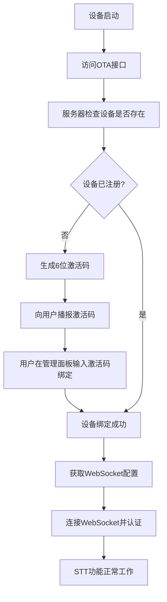

# 🎯 小智Android设备绑定完整解决方案

## 📋 问题分析总结

通过深入分析管理API和服务器代码，确认了STT失效的**真正原因**：

### 🔍 根本问题
1. **服务器端保护机制**：`receiveAudioHandle.py`中有严格的设备绑定检查
2. **Android应用绕过了设备绑定流程**：直接连接WebSocket，未完成设备注册和绑定
3. **认证令牌问题**：使用硬编码的"test-token"而非通过绑定获取的正确令牌

### 🔄 正确的设备生命周期


## 🛠️ 完整技术解决方案

### 方案1: 实现完整设备绑定流程 (推荐)

#### 1.1 添加OTA客户端和相关数据模型

```kotlin
// OTAClient.kt - 新增文件
package info.dourok.voicebot.data.network

import android.util.Log
import kotlinx.coroutines.Dispatchers
import kotlinx.coroutines.withContext
import okhttp3.*
import okhttp3.MediaType.Companion.toMediaType
import okhttp3.RequestBody.Companion.toRequestBody
import org.json.JSONObject
import java.io.IOException

class OTAClient(private val baseUrl: String) {
    companion object {
        private const val TAG = "OTAClient"
    }
    
    private val client = OkHttpClient.Builder()
        .connectTimeout(10, java.util.concurrent.TimeUnit.SECONDS)
        .readTimeout(10, java.util.concurrent.TimeUnit.SECONDS)
        .build()

    suspend fun checkDeviceActivation(
        deviceId: String, 
        clientId: String,
        appVersion: String = "1.0.0"
    ): OTAResponse = withContext(Dispatchers.IO) {
        val requestBody = JSONObject().apply {
            put("application", JSONObject().apply {
                put("version", appVersion)
                put("name", "xiaozhi-android")
            })
            put("macAddress", deviceId)
            put("board", JSONObject().apply {
                put("type", "android")
            })
            put("chipModelName", "android")
        }

        val request = Request.Builder()
            .url("$baseUrl/ota/")
            .post(requestBody.toString().toRequestBody("application/json".toMediaType()))
            .addHeader("Device-Id", deviceId)
            .addHeader("Client-Id", clientId)
            .addHeader("Content-Type", "application/json")
            .build()

        Log.i(TAG, "发送OTA请求到: ${request.url}")
        Log.d(TAG, "请求头: Device-Id=$deviceId, Client-Id=$clientId")
        Log.d(TAG, "请求体: ${requestBody.toString(2)}")

        try {
            val response = client.newCall(request).execute()
            val responseBody = response.body?.string() ?: ""
            
            Log.i(TAG, "OTA响应状态: ${response.code}")
            Log.d(TAG, "OTA响应内容: $responseBody")

            if (response.isSuccessful) {
                parseOTAResponse(responseBody)
            } else {
                Log.e(TAG, "OTA请求失败: ${response.code} - ${response.message}")
                throw IOException("OTA请求失败: ${response.code}")
            }
        } catch (e: Exception) {
            Log.e(TAG, "OTA请求异常: ${e.message}", e)
            throw e
        }
    }

    private fun parseOTAResponse(responseBody: String): OTAResponse {
        return try {
            val json = JSONObject(responseBody)
            
            // 检查是否需要激活
            val activation = json.optJSONObject("activation")
            if (activation != null) {
                val code = activation.getString("code")
                val message = activation.getString("message")
                val challenge = activation.getString("challenge")
                
                Log.i(TAG, "设备需要激活，激活码: $code")
                return OTAResponse.RequiresActivation(code, message, challenge)
            }
            
            // 获取WebSocket配置
            val websocket = json.optJSONObject("websocket")
            if (websocket != null) {
                val wsUrl = websocket.getString("url")
                Log.i(TAG, "获取到WebSocket URL: $wsUrl")
                return OTAResponse.Activated(wsUrl)
            }
            
            // 如果都没有，可能是错误响应
            Log.w(TAG, "未知的OTA响应格式: $responseBody")
            OTAResponse.Error("未知的服务器响应格式")
            
        } catch (e: Exception) {
            Log.e(TAG, "解析OTA响应失败: ${e.message}", e)
            OTAResponse.Error("解析服务器响应失败: ${e.message}")
        }
    }
}

// OTAResponse.kt - 新增文件
package info.dourok.voicebot.data.model

sealed class OTAResponse {
    data class RequiresActivation(
        val activationCode: String,
        val message: String,
        val challenge: String
    ) : OTAResponse()
    
    data class Activated(
        val websocketUrl: String
    ) : OTAResponse()
    
    data class Error(
        val message: String
    ) : OTAResponse()
}
```

#### 1.2 添加设备绑定API客户端

```kotlin
// DeviceBindingClient.kt - 新增文件
package info.dourok.voicebot.data.network

import android.util.Log
import kotlinx.coroutines.Dispatchers
import kotlinx.coroutines.withContext
import okhttp3.*
import okhttp3.MediaType.Companion.toMediaType
import okhttp3.RequestBody.Companion.toRequestBody
import org.json.JSONObject
import java.io.IOException

class DeviceBindingClient(private val baseUrl: String) {
    companion object {
        private const val TAG = "DeviceBindingClient"
    }
    
    private val client = OkHttpClient.Builder()
        .connectTimeout(10, java.util.concurrent.TimeUnit.SECONDS)
        .readTimeout(10, java.util.concurrent.TimeUnit.SECONDS)
        .build()

    suspend fun checkBindingStatus(
        agentId: String,
        activationCode: String,
        authToken: String
    ): BindingResult = withContext(Dispatchers.IO) {
        val request = Request.Builder()
            .url("$baseUrl/device/bind/$agentId/$activationCode")
            .post(ByteArray(0).toRequestBody())
            .addHeader("Authorization", "Bearer $authToken")
            .addHeader("Content-Type", "application/json")
            .build()

        Log.i(TAG, "检查绑定状态: $agentId - $activationCode")

        try {
            val response = client.newCall(request).execute()
            val responseBody = response.body?.string() ?: ""
            
            Log.i(TAG, "绑定检查响应: ${response.code}")
            Log.d(TAG, "响应内容: $responseBody")

            when (response.code) {
                200 -> {
                    val json = JSONObject(responseBody)
                    if (json.optInt("code", -1) == 0) {
                        BindingResult.Success
                    } else {
                        val errorMsg = json.optString("msg", "绑定失败")
                        Log.e(TAG, "绑定失败: $errorMsg")
                        BindingResult.Failed(errorMsg)
                    }
                }
                else -> {
                    Log.e(TAG, "绑定请求失败: ${response.code}")
                    BindingResult.Failed("网络请求失败: ${response.code}")
                }
            }
        } catch (e: Exception) {
            Log.e(TAG, "绑定检查异常: ${e.message}", e)
            BindingResult.Failed("网络异常: ${e.message}")
        }
    }
}

// BindingResult.kt - 新增文件
package info.dourok.voicebot.data.model

sealed class BindingResult {
    object Success : BindingResult()
    data class Failed(val message: String) : BindingResult()
}
```

#### 1.3 修改FormRepository集成设备绑定流程

```kotlin
// FormRepository.kt - 修改现有文件
package info.dourok.voicebot.data

import android.util.Log
import info.dourok.voicebot.data.model.*
import info.dourok.voicebot.data.network.OTAClient
import info.dourok.voicebot.data.network.DeviceBindingClient
import kotlinx.coroutines.flow.MutableStateFlow
import kotlinx.coroutines.flow.StateFlow
import javax.inject.Inject
import javax.inject.Singleton

@Singleton
class FormRepository @Inject constructor(
    private val settingsRepository: SettingsRepository,
    private val deviceInfo: DeviceInfo
) {
    companion object {
        private const val TAG = "FormRepository"
    }

    private val _resultFlow = MutableStateFlow<FormResult>(FormResult.Loading)
    val resultFlow: StateFlow<FormResult> = _resultFlow

    suspend fun submitForm(formData: ServerFormData) {
        _resultFlow.value = FormResult.Loading

        try {
            when (formData.serverType) {
                ServerType.XiaoZhi -> {
                    handleXiaoZhiConfig(formData.xiaoZhiConfig)
                }
                ServerType.SelfHost -> {
                    handleSelfHostConfig(formData.selfHostConfig)
                }
            }
        } catch (e: Exception) {
            Log.e(TAG, "表单提交失败: ${e.message}", e)
            _resultFlow.value = FormResult.Error(e.message ?: "未知错误")
        }
    }

    private suspend fun handleXiaoZhiConfig(config: XiaoZhiConfig) {
        when (config.transportType) {
            TransportType.MQTT -> {
                // MQTT模式：需要通过OTA获取MQTT配置
                Log.i(TAG, "处理MQTT配置...")
                handleMqttConfiguration(config)
            }
            TransportType.WebSockets -> {
                // WebSocket模式：需要设备绑定流程
                Log.i(TAG, "处理WebSocket配置...")
                handleWebSocketConfiguration(config)
            }
        }
    }

    private suspend fun handleWebSocketConfiguration(config: XiaoZhiConfig) {
        Log.i(TAG, "开始WebSocket设备绑定流程...")
        
        // 1. 检查设备激活状态
        val otaClient = OTAClient(config.qtaUrl.removeSuffix("/"))
        val otaResponse = otaClient.checkDeviceActivation(
            deviceId = deviceInfo.mac_address,
            clientId = deviceInfo.uuid
        )

        when (otaResponse) {
            is OTAResponse.RequiresActivation -> {
                Log.i(TAG, "设备需要激活，激活码: ${otaResponse.activationCode}")
                _resultFlow.value = FormResult.RequiresActivation(
                    activationCode = otaResponse.activationCode,
                    message = otaResponse.message,
                    agentId = "6bf580ad09cf4b1e8bd332dafb9e6d30", // 从URL参数获取
                    baseUrl = config.qtaUrl.removeSuffix("/ota/")
                )
            }
            
            is OTAResponse.Activated -> {
                Log.i(TAG, "设备已激活，配置WebSocket连接")
                settingsRepository.transportType = TransportType.WebSockets
                settingsRepository.webSocketUrl = otaResponse.websocketUrl
                settingsRepository.mqttConfig = null
                _resultFlow.value = FormResult.XiaoZhiResult(null)
            }
            
            is OTAResponse.Error -> {
                Log.e(TAG, "OTA检查失败: ${otaResponse.message}")
                _resultFlow.value = FormResult.Error(otaResponse.message)
            }
        }
    }

    private suspend fun handleMqttConfiguration(config: XiaoZhiConfig) {
        // 保持原有的MQTT处理逻辑
        // ... (保持原来的代码)
    }

    suspend fun completeDeviceBinding(
        agentId: String,
        activationCode: String,
        baseUrl: String
    ): BindingResult {
        Log.i(TAG, "完成设备绑定: $agentId - $activationCode")
        
        // 这里需要实际的认证令牌，暂时使用临时令牌
        val authToken = "temp-auth-token" // TODO: 实现正确的认证
        
        val bindingClient = DeviceBindingClient(baseUrl)
        return bindingClient.checkBindingStatus(agentId, activationCode, authToken)
    }

    private suspend fun handleSelfHostConfig(config: SelfHostConfig) {
        Log.i(TAG, "配置自托管服务器...")
        settingsRepository.transportType = TransportType.WebSockets
        settingsRepository.webSocketUrl = config.webSocketUrl
        settingsRepository.mqttConfig = null
        _resultFlow.value = FormResult.SelfHostResult
    }
}

// FormResult.kt - 修改现有文件
package info.dourok.voicebot.data.model

sealed class FormResult {
    object Loading : FormResult()
    data class XiaoZhiResult(val mqttConfig: MqttConfig?) : FormResult()
    object SelfHostResult : FormResult()
    data class RequiresActivation(
        val activationCode: String,
        val message: String,
        val agentId: String,
        val baseUrl: String
    ) : FormResult()
    data class Error(val message: String) : FormResult()
}
```

#### 1.4 添加设备激活UI组件

```kotlin
// DeviceActivationScreen.kt - 新增文件
package info.dourok.voicebot.ui

import androidx.compose.foundation.layout.*
import androidx.compose.foundation.text.KeyboardOptions
import androidx.compose.material.icons.Icons
import androidx.compose.material.icons.filled.Info
import androidx.compose.material3.*
import androidx.compose.runtime.*
import androidx.compose.ui.Alignment
import androidx.compose.ui.Modifier
import androidx.compose.ui.graphics.Color
import androidx.compose.ui.text.font.FontWeight
import androidx.compose.ui.text.input.KeyboardType
import androidx.compose.ui.text.style.TextAlign
import androidx.compose.ui.unit.dp
import androidx.compose.ui.unit.sp
import info.dourok.voicebot.data.model.BindingResult

@Composable
fun DeviceActivationScreen(
    activationCode: String,
    message: String,
    agentId: String,
    baseUrl: String,
    onBindingComplete: () -> Unit,
    onBindingCheck: (String, String, String) -> Unit,
    modifier: Modifier = Modifier
) {
    var userInputCode by remember { mutableStateOf("") }
    var isLoading by remember { mutableStateOf(false) }
    var errorMessage by remember { mutableStateOf<String?>(null) }

    Column(
        modifier = modifier
            .fillMaxSize()
            .padding(24.dp),
        horizontalAlignment = Alignment.CenterHorizontally,
        verticalArrangement = Arrangement.Center
    ) {
        // 标题
        Text(
            text = "设备激活",
            fontSize = 28.sp,
            fontWeight = FontWeight.Bold,
            color = MaterialTheme.colorScheme.primary
        )
        
        Spacer(modifier = Modifier.height(24.dp))
        
        // 激活码显示卡片
        Card(
            modifier = Modifier.fillMaxWidth(),
            colors = CardDefaults.cardColors(containerColor = MaterialTheme.colorScheme.primaryContainer)
        ) {
            Column(
                modifier = Modifier.padding(20.dp),
                horizontalAlignment = Alignment.CenterHorizontally
            ) {
                Icon(
                    imageVector = Icons.Default.Info,
                    contentDescription = null,
                    tint = MaterialTheme.colorScheme.primary,
                    modifier = Modifier.size(48.dp)
                )
                
                Spacer(modifier = Modifier.height(16.dp))
                
                Text(
                    text = "设备激活码",
                    fontSize = 18.sp,
                    fontWeight = FontWeight.Medium
                )
                
                Spacer(modifier = Modifier.height(8.dp))
                
                Text(
                    text = activationCode,
                    fontSize = 36.sp,
                    fontWeight = FontWeight.Bold,
                    color = MaterialTheme.colorScheme.primary,
                    letterSpacing = 4.sp
                )
            }
        }
        
        Spacer(modifier = Modifier.height(24.dp))
        
        // 说明文本
        Text(
            text = "请按照以下步骤完成设备绑定：",
            fontSize = 16.sp,
            fontWeight = FontWeight.Medium
        )
        
        Spacer(modifier = Modifier.height(16.dp))
        
        // 步骤说明
        Column(
            modifier = Modifier.fillMaxWidth(),
            verticalArrangement = Arrangement.spacedBy(12.dp)
        ) {
            StepItem(
                stepNumber = "1",
                description = "在浏览器中打开管理面板"
            )
            
            StepItem(
                stepNumber = "2", 
                description = "在设备管理页面点击"新增"按钮"
            )
            
            StepItem(
                stepNumber = "3",
                description = "输入上方显示的6位激活码: $activationCode"
            )
            
            StepItem(
                stepNumber = "4",
                description = "完成绑定后点击下方"检查绑定状态"按钮"
            )
        }
        
        Spacer(modifier = Modifier.height(32.dp))
        
        // 错误消息
        errorMessage?.let { error ->
            Card(
                modifier = Modifier.fillMaxWidth(),
                colors = CardDefaults.cardColors(containerColor = MaterialTheme.colorScheme.errorContainer)
            ) {
                Text(
                    text = error,
                    modifier = Modifier.padding(16.dp),
                    color = MaterialTheme.colorScheme.onErrorContainer
                )
            }
            Spacer(modifier = Modifier.height(16.dp))
        }
        
        // 检查按钮
        Button(
            onClick = {
                isLoading = true
                errorMessage = null
                onBindingCheck(agentId, activationCode, baseUrl)
            },
            modifier = Modifier.fillMaxWidth(),
            enabled = !isLoading
        ) {
            if (isLoading) {
                CircularProgressIndicator(
                    modifier = Modifier.size(16.dp),
                    color = MaterialTheme.colorScheme.onPrimary
                )
                Spacer(modifier = Modifier.width(8.dp))
            }
            Text("检查绑定状态")
        }
        
        Spacer(modifier = Modifier.height(16.dp))
        
        // 帮助文本
        Text(
            text = "如果长时间无法绑定，请联系管理员或检查网络连接",
            fontSize = 14.sp,
            color = MaterialTheme.colorScheme.onSurfaceVariant,
            textAlign = TextAlign.Center
        )
    }

    // 处理绑定结果
    LaunchedEffect(Unit) {
        // 这里可以添加绑定结果的监听逻辑
    }
}

@Composable
private fun StepItem(
    stepNumber: String,
    description: String,
    modifier: Modifier = Modifier
) {
    Row(
        modifier = modifier.fillMaxWidth(),
        verticalAlignment = Alignment.CenterVertically
    ) {
        Surface(
            modifier = Modifier.size(32.dp),
            shape = CircleShape,
            color = MaterialTheme.colorScheme.primary
        ) {
            Box(
                contentAlignment = Alignment.Center
            ) {
                Text(
                    text = stepNumber,
                    color = MaterialTheme.colorScheme.onPrimary,
                    fontWeight = FontWeight.Bold
                )
            }
        }
        
        Spacer(modifier = Modifier.width(16.dp))
        
        Text(
            text = description,
            fontSize = 14.sp,
            modifier = Modifier.weight(1f)
        )
    }
}
```

#### 1.5 修改现有的FormScreen集成激活流程

```kotlin
// 在ServerFormScreen.kt中添加激活状态处理
@Composable
fun ServerFormScreen(
    viewModel: ServerFormViewModel = hiltViewModel(),
    onNavigateToChat: () -> Unit
) {
    // ... 现有代码 ...
    
    when (val result = formResult) {
        is FormResult.RequiresActivation -> {
            DeviceActivationScreen(
                activationCode = result.activationCode,
                message = result.message,
                agentId = result.agentId,
                baseUrl = result.baseUrl,
                onBindingComplete = onNavigateToChat,
                onBindingCheck = { agentId, code, baseUrl ->
                    viewModel.checkDeviceBinding(agentId, code, baseUrl)
                }
            )
        }
        
        // ... 其他状态处理 ...
    }
}
```

### 方案2: 临时绕过方案 (快速测试)

如果您有服务器管理权限，可以临时绕过绑定机制进行测试：

#### 2.1 手动在管理面板添加设备

1. 访问管理面板: http://47.122.144.73:8002/#/device-management?agentId=6bf580ad09cf4b1e8bd332dafb9e6d30
2. 使用管理员账号登录
3. 在设备管理页面点击"新增"
4. 输入Android设备的MAC地址作为激活码(可以使用Android设备的实际MAC或生成的UUID)

#### 2.2 修改服务器跳过绑定检查(仅用于调试)

在服务器的`receiveAudioHandle.py`中临时注释绑定检查：

```python
async def startToChat(conn, text):
    # 临时注释掉绑定检查用于调试
    # if conn.need_bind:
    #     await check_bind_device(conn)
    #     return
    
    # 直接进行STT处理...
```

## 🔒 安全考虑

1. **认证令牌管理**: 避免硬编码令牌，实现动态令牌获取
2. **设备唯一标识**: 使用设备真实MAC地址或安全的UUID
3. **激活码时效性**: 服务器端的激活码应有时效限制
4. **网络安全**: 在生产环境中使用HTTPS/WSS协议
5. **错误处理**: 完善的错误处理和用户提示

## 🧪 测试验证步骤

1. **完整绑定流程测试**:
   - 使用真实设备ID运行Android应用
   - 验证OTA接口返回激活码
   - 在管理面板完成绑定
   - 验证STT功能恢复

2. **错误场景测试**:
   - 网络连接失败
   - 激活码过期
   - 重复绑定
   - 无效的代理ID

3. **性能测试**:
   - 绑定流程耗时
   - WebSocket连接稳定性
   - 音频传输质量

## 📝 实施建议

1. **优先级**: 建议先实施方案1中的OTA集成和激活UI
2. **渐进实施**: 可以先实现基础绑定流程，后续完善认证和安全机制
3. **回退策略**: 保留原有的硬编码配置作为开发模式备选
4. **日志监控**: 完善的日志记录便于问题诊断

通过实施此方案，Android应用将完全符合服务器端的设备绑定要求，从而解决STT功能失效的问题。 