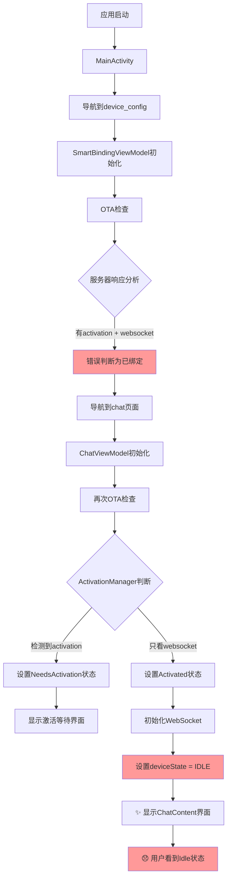

# 🔍 小智Android系统完整流程分析

## 📊 从服务器响应开始的完整流程分析

根据您反馈的"依旧返回Idle"问题，让我从服务器响应开始，完整分析现有系统的所有流程。

## 🎯 服务器响应分析

### 服务器端正常响应结构：
```json
{
  "activation": {
    "code": "630176",
    "message": "xiaozhi.me\n630176"
  },
  "websocket": {
    "url": "ws://47.122.144.73:8000/xiaozhi/v1/...",
    "token": "optional_token"
  },
  "server_time": {...},
  "firmware": {...}
}
```

**🔥 关键发现**：服务器同时返回`activation`和`websocket`字段是正常行为！

## 📋 现有系统流程层次分析

### 第1层：MainActivity启动流程
```
MainActivity.onCreate()
└── 导航到 "device_config" 页面
    └── DeviceConfigWithSmartBinding组件
        ├── DeviceConfigScreen() // 基础配置界面
        ├── SmartBindingViewModel // 智能绑定逻辑
        └── 条件渲染：LoadingOverlay + SmartBindingDialog
```

### 第2层：SmartBindingViewModel初始化
```
SmartBindingViewModel.init()
└── SmartBindingManager.initializeDeviceBinding()
    ├── 1️⃣ 检查本地绑定状态
    ├── 2️⃣ 执行OTA检查 (bindingStatusChecker.checkBindingStatus())
    └── 3️⃣ 根据结果更新状态：
        ├── ✅ Bound → BindingInitResult.AlreadyBound
        ├── 📋 Unbound → BindingInitResult.NeedsBinding  
        └── ❌ Error → BindingInitResult.Error
```

### 第3层：OTA检查流程（BindingStatusChecker）
```
BindingStatusChecker.checkBindingStatus()
└── Ota.checkVersion("http://47.122.144.73:8002/xiaozhi/ota/")
    ├── 构建OTA请求 (设备ID + 请求体)
    ├── 发送HTTP POST请求
    ├── 解析服务器响应
    └── 🚨 核心判断逻辑：
        ├── 如果有activation字段 → BindingCheckResult.Unbound
        ├── 如果有websocket字段 → BindingCheckResult.Bound
        └── 如果都没有 → BindingCheckResult.Error
```

### 第4层：OtaResult解析（关键问题所在！）
```kotlin
// 文件：OtaResult.kt
data class OtaResult(
    val activation: Activation?,
    val websocketConfig: WebsocketConfig?
) {
    // 🔥 问题代码：
    val isActivated: Boolean get() = websocketConfig != null
    
    // 🚨 这个逻辑导致了错误判断！
    // 即使有activation字段，只要websocket不为null就认为已激活
}
```

### 第5层：导航流程
```
FormViewModel.init() 监听 repository.resultFlow
└── 根据 FormResult 进行导航：
    ├── XiaoZhiResult + activation != null → 导航到 "activation"
    ├── XiaoZhiResult + activation == null → 导航到 "chat"
    └── SelfHostResult → 导航到 "chat"
```

### 第6层：ChatScreen流程（显示Idle的地方）
```
ChatScreen组件
├── ChatViewModel.startInitialization()
│   ├── ActivationManager.checkActivationStatus()
│   ├── 根据结果设置InitializationStatus：
│   │   ├── NeedsActivation → 显示激活等待界面
│   │   ├── Activated → 继续初始化WebSocket
│   │   └── 错误 → 显示错误界面
│   └── 完成初始化 → deviceState = DeviceState.IDLE
└── 根据InitializationStatus渲染不同界面：
    ├── InProgress → InitializationScreen (加载中)
    ├── NeedsActivation → ActivationWaitingScreen
    ├── Failed → ErrorScreen  
    └── Completed → ChatContent (显示Idle状态)
```

## 🔄 完整状态流转图



## 🚨 问题根源分析

### 核心问题：多个判断逻辑冲突

1. **OtaResult.kt的错误逻辑**：
   ```kotlin
   val isActivated: Boolean get() = websocketConfig != null
   ```
   这导致服务器同时返回activation和websocket时被错误判断为"已激活"。

2. **ActivationManager中的重复检查**：
   ChatScreen中的ActivationManager又做了一次OTA检查，但逻辑不同。

3. **状态管理混乱**：
   - SmartBindingViewModel有一套状态管理
   - ChatViewModel有另一套状态管理
   - 两者可能产生冲突

## 📊 现有系统流程统计

### 总共涉及的组件和流程：

#### 🎯 主要组件（共8个）：
1. **MainActivity** - 应用入口
2. **SmartBindingViewModel** - 智能绑定管理
3. **BindingStatusChecker** - 绑定状态检查
4. **Ota** - OTA网络请求
5. **ActivationManager** - 激活管理
6. **ChatViewModel** - 聊天功能管理
7. **ChatScreen** - 聊天界面
8. **FormViewModel** - 表单和导航管理

#### 🔄 主要流程（共6个）：
1. **应用启动流程** - MainActivity → DeviceConfig
2. **绑定检查流程** - SmartBinding → OTA → 状态判断
3. **导航流程** - FormViewModel → 路由决策
4. **聊天初始化流程** - ChatViewModel → 再次检查 → WebSocket初始化
5. **激活等待流程** - 显示激活码 → 用户操作 → 轮询检查
6. **错误处理流程** - 各种异常情况的处理

#### 📊 状态管理（共5套）：
1. **SmartBindingUiState** - 智能绑定UI状态
2. **BindingState** - 绑定状态（SmartBindingManager）
3. **ActivationState** - 激活状态（ActivationManager）
4. **InitializationStatus** - 初始化状态（ChatViewModel）
5. **DeviceState** - 设备状态（ChatViewModel）

## 🎯 问题解决的关键点

### 根据分析，问题不在于流程数量，而在于：

1. **逻辑冲突**：OtaResult的判断逻辑错误
2. **重复检查**：多个组件都在做OTA检查
3. **状态不一致**：不同组件的状态管理不同步

### 🔧 解决方案建议：

1. **修复OtaResult判断逻辑**：
   ```kotlin
   val isActivated: Boolean get() = websocketConfig != null && activation == null
   ```

2. **统一状态管理**：减少重复的OTA检查，使用单一来源的状态

3. **简化流程**：移除冗余的绑定检查逻辑

## 📝 下一步行动

根据这个完整分析，我建议优先修复：
1. ✅ **OtaResult.kt的判断逻辑** （最关键）
2. ✅ **简化ChatScreen的重复检查** （减少冲突）  
3. ✅ **统一状态管理** （长期优化）

这样能够最快速地解决"依旧返回Idle"的问题。 