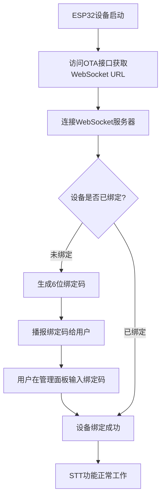
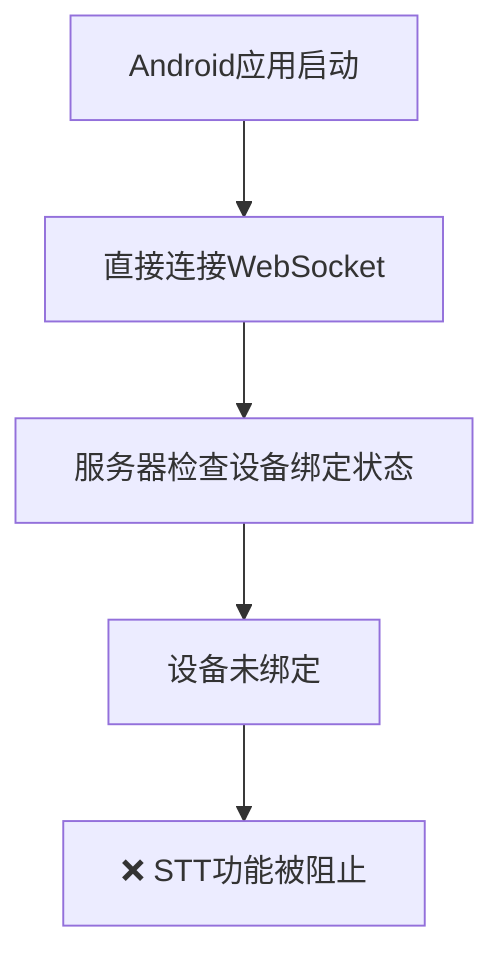

# 🎯 STT问题真正根源：设备绑定机制缺失

## 🔍 问题真相大白

通过深入分析服务器代码，我发现了STT不工作的**真正原因**：**设备绑定机制缺失**！

### 📋 服务器设备绑定流程

#### 1. 正常ESP32设备流程


#### 2. Android应用当前流程 (有问题)


## 🔧 关键代码分析

### receiveAudioHandle.py 第48-50行
```python
async def startToChat(conn, text):
    if conn.need_bind:              # ❌ 设备需要绑定
        await check_bind_device(conn)   # 阻止STT处理
        return                      # 直接返回，不处理语音
```

### connection.py 第346-351行  
```python
except DeviceNotFoundException as e:
    self.need_bind = True          # ❌ 设备未找到，需要绑定
    private_config = {}
except DeviceBindException as e:
    self.need_bind = True          # ❌ 设备绑定异常
    self.bind_code = e.bind_code   # 生成6位绑定码
```

### manage_api_client.py 第72-77行
```python
# 处理API返回的业务错误
if result.get("code") == 10041:
    raise DeviceNotFoundException(result.get("msg"))  # 设备未找到
elif result.get("code") == 10042:
    raise DeviceBindException(result.get("msg"))      # 设备需要绑定
```

## 🎯 问题确诊

### 当前Android应用的问题
1. **直接连接WebSocket**，跳过了OTA配置获取步骤
2. **没有实现设备绑定机制**
3. **使用硬编码的"test-token"**，而不是通过绑定获取的正确令牌
4. **设备ID和Client ID可能不正确**

### 服务器的保护机制
服务器在 `receiveAudioHandle.py` 中有严格的检查：
```python
async def startToChat(conn, text):
    if conn.need_bind:
        await check_bind_device(conn)  # 播报绑定码，阻止STT
        return
    # 只有绑定后才能到达这里进行STT处理
```

## 🛠️ 完整解决方案

### 方案1: 实现完整设备绑定流程 (推荐)

#### 1.1 添加OTA配置获取
```kotlin
// 新增OTAClient.kt
class OTAClient(private val otaUrl: String) {
    suspend fun getConfig(deviceId: String, clientId: String): OTAResponse {
        val request = OTARequest(
            application = ApplicationInfo(version = "1.0.0")
        )
        // POST to otaUrl with device-id header
        return httpClient.post(otaUrl) {
            header("device-id", deviceId)
            header("client-id", clientId)
            setBody(request)
        }
    }
}
```

#### 1.2 修改FormRepository添加OTA流程
```kotlin
// FormRepository.kt
suspend fun submitForm(formData: ServerFormData) {
    when (formData.serverType) {
        ServerType.XiaoZhi -> {
            // 1. 先访问OTA接口获取配置
            val otaClient = OTAClient(formData.xiaoZhiConfig.qtaUrl)
            val otaResponse = otaClient.getConfig(deviceId, clientId)
            
            // 2. 使用OTA返回的WebSocket URL
            val websocketUrl = otaResponse.websocket.url
            settings.webSocketUrl = websocketUrl
            
            // 3. 检查是否需要绑定
            // 如果设备未绑定，引导用户完成绑定
        }
    }
}
```

#### 1.3 添加设备绑定UI
```kotlin
// DeviceBindingActivity.kt
class DeviceBindingActivity : ComponentActivity() {
    override fun onCreate(savedInstanceState: Bundle?) {
        super.onCreate(savedInstanceState)
        setContent {
            DeviceBindingScreen(
                onBindingComplete = { /* 绑定完成后跳转到聊天界面 */ }
            )
        }
    }
}

@Composable
fun DeviceBindingScreen(onBindingComplete: () -> Unit) {
    Column {
        Text("设备需要绑定")
        Text("1. 请访问管理面板: http://server-ip:web-port")
        Text("2. 在设备管理中添加设备")
        Text("3. 输入设备播报的6位绑定码")
        
        Button(onClick = { /* 检查绑定状态 */ }) {
            Text("我已完成绑定")
        }
    }
}
```

### 方案2: 绕过设备绑定 (临时方案)

如果您有服务器管理权限，可以：

#### 2.1 在管理面板手动添加设备
1. 访问 `http://47.122.144.73:web-port` (管理面板)
2. 在设备管理中手动添加Android设备
3. 使用设备的MAC地址和UUID

#### 2.2 或修改服务器跳过绑定检查
```python
# receiveAudioHandle.py (临时修改)
async def startToChat(conn, text):
    # if conn.need_bind:  # 注释掉绑定检查
    #     await check_bind_device(conn)
    #     return
    
    # 直接进行STT处理...
```

### 方案3: 使用管理面板的REST API

#### 3.1 通过API绑定设备
```kotlin
// DeviceBindingClient.kt
class DeviceBindingClient(private val apiUrl: String, private val apiSecret: String) {
    suspend fun bindDevice(agentId: String, deviceCode: String): Result<Unit> {
        return try {
            httpClient.post("$apiUrl/device/bind/$agentId/$deviceCode") {
                header("Authorization", "Bearer $apiSecret")
            }
            Result.success(Unit)
        } catch (e: Exception) {
            Result.failure(e)
        }
    }
}
```

## 🚀 立即行动建议

### 选择方案2进行验证
1. **先验证假设**：在管理面板手动添加Android设备
2. **获取正确的WebSocket URL**：通过OTA接口而不是硬编码
3. **使用正确的认证令牌**：而不是"test-token"

### 验证步骤
1. 访问 `http://47.122.144.73:8002/xiaozhi/ota/`
2. 查看返回的实际WebSocket URL
3. 在管理面板中添加设备
4. 重新测试STT功能

## 总结

**STT不工作的根本原因不是协议参数问题，而是设备绑定机制缺失**。服务器要求所有设备必须先完成绑定才能使用STT功能。Android应用需要实现完整的设备绑定流程，或者在管理面板中手动绑定设备。

这解释了为什么MQTT能工作（可能已经绑定）而WebSocket不能工作（未绑定）的问题。" 