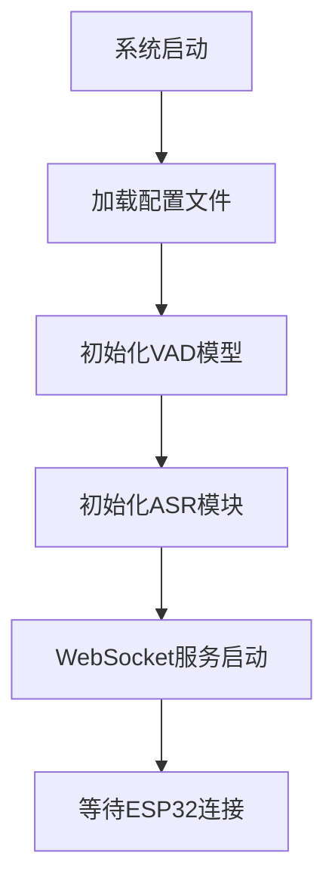
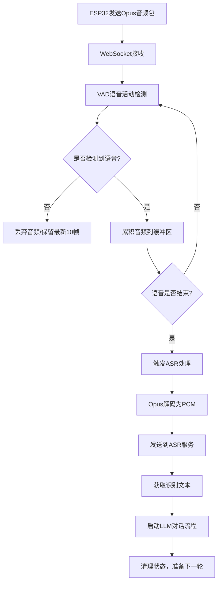

# ESP32小智语音STT（语音转文本）机制深度分析

## 📋 项目概述

ESP32小智语音项目的STT（Speech-to-Text）功能位于服务器端，通过WebSocket接收ESP32设备发送的音频数据，并将语音转换为文本用于后续的LLM处理。

## 🗂️ STT文件结构分析

### 核心目录结构
```
xiaozhi-server/
├── core/
│   ├── providers/
│   │   ├── asr/                    # STT/ASR核心实现目录
│   │   │   ├── base.py            # ASR基础抽象类
│   │   │   ├── aliyun.py          # 阿里云ASR实现
│   │   │   ├── baidu.py           # 百度ASR实现
│   │   │   ├── doubao.py          # 豆包ASR实现
│   │   │   ├── fun_local.py       # FunASR本地模型
│   │   │   ├── fun_server.py      # FunASR服务器模式
│   │   │   ├── sherpa_onnx_local.py # Sherpa-ONNX本地模型
│   │   │   └── tencent.py         # 腾讯ASR实现
│   │   └── vad/                   # 语音活动检测
│   │       ├── base.py           # VAD基础类
│   │       └── silero.py         # Silero VAD实现
│   ├── handle/
│   │   └── receiveAudioHandle.py  # 音频接收处理核心逻辑
│   └── connection.py              # 连接管理和音频流程调度
├── config.yaml                    # 主配置文件（STT相关配置）
└── models/                        # 本地模型存储目录
    ├── SenseVoiceSmall/           # FunASR SenseVoice模型
    └── snakers4_silero-vad/       # Silero VAD模型
```

## 🔧 STT机制构成组件

### 1. VAD（语音活动检测）组件
**位置：** `core/providers/vad/silero.py`

**功能：**
- 实时检测音频流中的语音活动
- 判断用户是否在说话
- 确定语音的开始和结束时机

**核心机制：**
```python
class VADProvider(VADProviderBase):
    def __init__(self, config):
        # 加载Silero VAD模型
        self.model, self.utils = torch.hub.load(
            repo_or_dir=config["model_dir"],
            source="local", 
            model="silero_vad"
        )
        
        # 配置参数
        self.vad_threshold = 0.5      # 语音检测阈值
        self.silence_threshold_ms = 700  # 静默持续时间阈值

    def is_vad(self, conn, opus_packet):
        # 1. Opus音频解码为PCM
        pcm_frame = self.decoder.decode(opus_packet, 960)
        
        # 2. 累积音频缓冲区
        conn.client_audio_buffer.extend(pcm_frame)
        
        # 3. 处理512采样点的音频块
        while len(conn.client_audio_buffer) >= 512 * 2:
            chunk = conn.client_audio_buffer[:512 * 2]
            
            # 4. 转换为模型输入格式
            audio_int16 = np.frombuffer(chunk, dtype=np.int16)
            audio_float32 = audio_int16.astype(np.float32) / 32768.0
            audio_tensor = torch.from_numpy(audio_float32)
            
            # 5. VAD模型检测
            speech_prob = self.model(audio_tensor, 16000).item()
            client_have_voice = speech_prob >= self.vad_threshold
            
            # 6. 判断语音结束时机
            if conn.client_have_voice and not client_have_voice:
                stop_duration = time.time() * 1000 - conn.client_have_voice_last_time
                if stop_duration >= self.silence_threshold_ms:
                    conn.client_voice_stop = True  # 触发STT处理
```

### 2. ASR（语音识别）基础接口
**位置：** `core/providers/asr/base.py`

**接口定义：**
```python
class ASRProviderBase(ABC):
    @abstractmethod
    def save_audio_to_file(self, pcm_data: List[bytes], session_id: str) -> str:
        """PCM数据保存为WAV文件"""
        pass

    @abstractmethod
    async def speech_to_text(self, opus_data: List[bytes], session_id: str) -> Tuple[Optional[str], Optional[str]]:
        """将语音数据转换为文本"""
        pass
```

### 3. ASR具体实现（以阿里云为例）
**位置：** `core/providers/asr/aliyun.py`

**核心机制：**
```python
class ASRProvider(ASRProviderBase):
    def __init__(self, config: dict):
        # 阿里云ASR配置
        self.access_key_id = config.get("access_key_id")
        self.access_key_secret = config.get("access_key_secret")
        self.app_key = config.get("appkey")
        self.host = "nls-gateway-cn-shanghai.aliyuncs.com"
        self.base_url = f"https://{self.host}/stream/v1/asr"
        
        # 音频参数
        self.sample_rate = 16000
        self.format = "wav"

    def decode_opus(self, opus_data: List[bytes]) -> List[bytes]:
        """Opus解码为PCM"""
        decoder = opuslib_next.Decoder(16000, 1)
        pcm_data = []
        for opus_packet in opus_data:
            pcm_frame = decoder.decode(opus_packet, 960)
            pcm_data.append(pcm_frame)
        return pcm_data

    async def speech_to_text(self, opus_data: List[bytes], session_id: str) -> Tuple[Optional[str], Optional[str]]:
        """语音转文本核心流程"""
        try:
            # 1. Opus解码为PCM
            pcm_data = self.decode_opus(opus_data, session_id)
            
            # 2. 保存为WAV文件（可选）
            if self.save_audio_files:
                file_path = self.save_audio_to_file(pcm_data, session_id)
            
            # 3. 准备音频数据
            pcm_bytes = b''.join(pcm_data)
            
            # 4. 发送到阿里云ASR服务
            result_text = await self._send_request(pcm_bytes)
            
            return result_text, None
            
        except Exception as e:
            logger.error(f"ASR处理失败: {e}")
            return None, str(e)
```

### 4. 音频接收处理核心逻辑
**位置：** `core/handle/receiveAudioHandle.py`

**处理流程：**
```python
async def handleAudioMessage(conn, audio):
    """音频消息处理核心流程"""
    
    # 1. 检查是否允许接收音频
    if not conn.asr_server_receive:
        return
    
    # 2. VAD语音活动检测
    if conn.client_listen_mode == "auto":
        have_voice = conn.vad.is_vad(conn, audio)
    else:
        have_voice = conn.client_have_voice

    # 3. 无语音时的处理
    if have_voice == False and conn.client_have_voice == False:
        # 保留最新10帧音频，解决ASR句首丢字问题
        conn.asr_audio.append(audio)
        conn.asr_audio = conn.asr_audio[-10:]
        return
    
    # 4. 有语音时累积音频数据
    conn.asr_audio.append(audio)
    
    # 5. 检测语音结束，触发STT处理
    if conn.client_voice_stop:
        conn.asr_server_receive = False
        
        # 6. 音频长度检查
        if len(conn.asr_audio) < 15:
            conn.asr_server_receive = True  # 音频太短，重新开始
        else:
            # 7. 调用ASR进行语音识别
            text, error = await conn.asr.speech_to_text(conn.asr_audio, conn.session_id)
            
            if text and len(text.strip()) > 0:
                # 8. 启动对话流程
                await startToChat(conn, text)
            else:
                conn.asr_server_receive = True
        
        # 9. 清理状态，准备下一轮
        conn.asr_audio.clear()
        conn.reset_vad_states()
```

## ⚙️ 配置机制分析

### 主配置文件结构
**位置：** `config.yaml`

**ASR选择配置：**
```yaml
selected_module:
  VAD: SileroVAD     # 语音活动检测模块
  ASR: FunASR        # 语音识别模块

ASR:
  FunASR:            # 本地FunASR模型
    type: fun_local
    model_dir: models/SenseVoiceSmall
    output_dir: tmp/
    
  AliyunASR:         # 阿里云ASR服务
    type: aliyun
    appkey: 你的阿里云Appkey
    access_key_id: 你的access_key_id
    access_key_secret: 你的access_key_secret
    output_dir: tmp/
    
  DoubaoASR:         # 豆包ASR服务
    type: doubao
    appid: 你的火山引擎appid
    access_token: 你的access_token
    cluster: volcengine_input_common

VAD:
  SileroVAD:
    type: silero
    threshold: 0.5                    # VAD检测阈值
    model_dir: models/snakers4_silero-vad
    min_silence_duration_ms: 700      # 最小静默持续时间
```

## 🔄 完整STT工作流程

### 1. 初始化阶段


### 2. 实时处理流程


### 3. 详细数据流
```
ESP32设备 → WebSocket → receiveAudioHandle.py
    ↓
VAD检测(silero.py) → 语音活动判断
    ↓
音频缓冲区累积 → 语音结束检测
    ↓
ASR处理(aliyun.py/fun_local.py等) → 文本识别
    ↓
意图识别 → LLM处理 → TTS合成 → 返回ESP32
```

## 🎯 关键技术特点

### 1. 多ASR引擎支持
- **本地模型**：FunASR SenseVoice、Sherpa-ONNX
- **云端服务**：阿里云、腾讯云、百度、豆包
- **灵活切换**：通过配置文件一键切换

### 2. 智能VAD机制
- **Silero VAD模型**：高精度语音活动检测
- **自适应阈值**：可配置检测敏感度
- **静默检测**：智能判断语音结束时机

### 3. 音频处理优化
- **Opus编码**：高效音频传输
- **实时解码**：边接收边处理
- **缓冲区管理**：解决句首丢字问题

### 4. 异步处理架构
- **非阻塞设计**：不影响其他功能
- **并发处理**：支持多设备同时连接
- **错误恢复**：ASR失败自动恢复

## 🔧 性能优化特性

### 1. 音频预处理
- 保留最新10帧音频解决句首丢字
- 音频长度检查避免无效识别
- 智能静默检测提高识别准确性

### 2. 内存管理
- 及时清理音频缓冲区
- 限制缓冲区大小防止内存泄漏
- 完成识别后立即释放资源

### 3. 网络优化
- WebSocket长连接复用
- 音频数据流式传输
- 错误重试机制

## 📊 支持的ASR引擎对比

| 引擎 | 类型 | 优点 | 缺点 | 适用场景 |
|------|------|------|------|----------|
| FunASR | 本地 | 免费、隐私、低延迟 | 需要GPU、模型较大 | 私有部署 |
| 阿里云ASR | 云端 | 高精度、支持方言 | 收费、需要网络 | 商业应用 |
| 豆包ASR | 云端 | 新技术、效果好 | 收费、API限制 | 创新应用 |
| 腾讯ASR | 云端 | 稳定性好、API完善 | 收费、配置复杂 | 企业应用 |
| Sherpa-ONNX | 本地 | 轻量级、跨平台 | 精度稍低 | 边缘设备 |

## 🚀 ESP32与Android的STT差异

### ESP32端STT特点
1. **硬件处理**：音频在硬件层面采集和预处理
2. **实时传输**：通过WebSocket实时发送音频包
3. **服务器处理**：所有STT计算在服务器端完成
4. **低功耗设计**：ESP32只负责音频采集和传输

### Android端STT特点  
1. **软件处理**：在应用层面处理音频
2. **本地缓冲**：先在本地缓冲再发送
3. **可选本地**：可以使用设备自带的STT
4. **资源丰富**：可利用手机的计算资源

这种架构设计使得ESP32设备能够以最小的资源消耗实现高质量的语音识别功能，所有重计算都放在服务器端进行，体现了边缘计算和云计算结合的优势。 