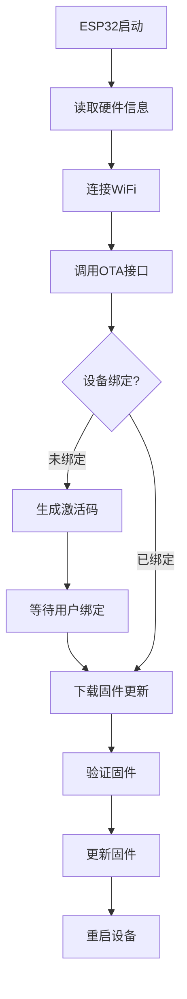
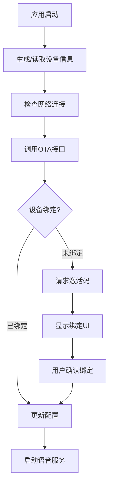

# 📱⚡ ESP32 vs Android OTA 深度对比分析

## 🔍 核心差异概览

| 方面 | ESP32硬件设备 | Android应用 |
|------|---------------|-------------|
| **设备类型** | 真实硬件 | 软件模拟 |
| **OTA目的** | 固件更新 + 设备管理 | 设备注册 + 绑定管理 |
| **设备ID** | 硬件MAC地址 | 生成/配置ID |
| **持久性** | 永久硬件标识 | 应用重装可变 |
| **网络环境** | WiFi限制 | 移动网络 + WiFi |

## 🔧 技术架构差异

### 1. 设备信息结构

#### ESP32真实设备信息：
```json
{
  "version": 2,
  "flash_size": 8388608,           // 真实Flash大小
  "psram_size": 4194304,           // 真实PSRAM大小
  "mac_address": "aa:bb:cc:dd:ee:ff", // 硬件MAC地址
  "chip_model_name": "esp32s3",    // 真实芯片型号
  "chip_info": {
    "model": 3,                    // 硬件芯片型号
    "cores": 2,                    // 真实CPU核心数
    "revision": 1,                 // 硬件版本
    "features": 5                  // 硬件特性
  },
  "application": {
    "name": "xiaozhi-voice",       // 固件名称
    "version": "1.3.0",            // 固件版本
    "compile_time": "2025-01-20T12:34:56Z",
    "idf_version": "5.1",          // ESP-IDF版本
    "elf_sha256": "real_firmware_hash"
  }
}
```

#### Android模拟设备信息：
```json
{
  "version": 2,
  "flash_size": 8388608,           // 模拟值
  "psram_size": 4194304,           // 模拟值
  "mac_address": "00:11:22:33:44:55", // 固定/生成值
  "chip_model_name": "android",    // 标识为Android
  "chip_info": {
    "model": 999,                  // Android标识
    "cores": 8,                    // 手机CPU核心
    "revision": 1,                 // 应用版本
    "features": 0                  // Android特性
  },
  "application": {
    "name": "xiaozhi-android",     // 应用名称
    "version": "1.0.0",            // 应用版本
    "compile_time": "build_time",
    "idf_version": "android-sdk",  // Android SDK
    "elf_sha256": "app_hash"
  }
}
```

## 🔄 OTA流程差异

### ESP32 OTA流程：


### Android OTA流程：


## 📊 关键差异分析

### 1. 设备标识管理

#### ESP32 (真实硬件)：
```c
// ESP32固件代码
void get_device_info() {
    uint8_t mac[6];
    esp_wifi_get_mac(WIFI_IF_STA, mac);
    snprintf(device_id, sizeof(device_id), 
             "%02x:%02x:%02x:%02x:%02x:%02x",
             mac[0], mac[1], mac[2], mac[3], mac[4], mac[5]);
}
```

**特点**：
- ✅ 硬件级唯一标识
- ✅ 永久不变
- ✅ 无法伪造
- ❌ 无法自定义

#### Android (软件模拟)：
```kotlin
// Android应用代码
class DeviceInfo {
    fun generateMacAddress(): String {
        return "00:11:22:33:44:55" // 固定或生成
    }
}
```

**特点**：
- ✅ 可自定义配置
- ✅ 支持测试场景
- ✅ 灵活管理
- ❌ 应用重装可能改变
- ❌ 可能出现冲突

### 2. OTA更新内容

#### ESP32：
```json
{
  "firmware": {
    "version": "1.4.0",
    "url": "https://server.com/firmware/xiaozhi_v1.4.0.bin",
    "size": 2048576,
    "sha256": "abcd1234...",
    "release_notes": "修复语音识别bug"
  }
}
```

#### Android：
```json
{
  "app_config": {
    "version": "1.1.0",
    "websocket_url": "ws://47.122.144.73:8000/xiaozhi/v1/",
    "features": ["stt", "tts", "wake_word"],
    "settings": {
      "audio_format": "opus",
      "sample_rate": 16000
    }
  }
}
```

### 3. 绑定持久性

#### ESP32绑定：
- **存储位置**：NVS (Non-Volatile Storage)
- **持久性**：除非擦除Flash，否则永久保存
- **恢复**：设备重启后自动恢复绑定状态

#### Android绑定：
- **存储位置**：SharedPreferences/DataStore
- **持久性**：应用数据清除时丢失
- **恢复**：需要重新绑定或从云端同步

## 🎯 实际应用场景

### ESP32语音助手场景：
```
1. 用户购买ESP32设备
2. 首次上电，设备进入配网模式
3. 连接WiFi后，自动请求OTA检查
4. 服务器返回激活码
5. 用户在管理界面输入激活码完成绑定
6. 设备定期检查固件更新
7. 发现新版本时自动下载并更新
```

### Android应用场景：
```
1. 用户下载安装应用
2. 首次启动，生成虚拟设备信息
3. 检查设备绑定状态
4. 如未绑定，引导用户完成绑定
5. 定期同步配置和功能更新
6. 应用更新通过Google Play Store
```

## 🔧 统一OTA接口设计

### 服务器端适配：
```python
# 服务器端OTA接口
class OTAHandler:
    def handle_device_request(self, device_info):
        device_type = self.detect_device_type(device_info)
        
        if device_type == "esp32":
            return self.handle_esp32_ota(device_info)
        elif device_type == "android":
            return self.handle_android_ota(device_info)
        else:
            return self.handle_unknown_device(device_info)
    
    def detect_device_type(self, device_info):
        chip_model = device_info.get("chip_model_name", "")
        if chip_model.startswith("esp32"):
            return "esp32"
        elif chip_model == "android":
            return "android"
        return "unknown"
```

### 响应格式差异：
```json
// ESP32响应
{
  "firmware": {...},
  "config": {...},
  "websocket": {...}
}

// Android响应  
{
  "app_config": {...},
  "websocket": {...}
  // 无firmware字段
}
```

## 💡 Android应用优化建议

### 1. 设备标识策略：
```kotlin
class DeviceIdentityManager {
    // 方案1：基于Android ID
    fun getAndroidBasedId(): String {
        return Settings.Secure.getString(
            contentResolver, 
            Settings.Secure.ANDROID_ID
        )
    }
    
    // 方案2：自定义可配置ID
    fun getConfigurableId(): String {
        return dataStore.getDeviceId() ?: generateNewId()
    }
    
    // 方案3：混合策略
    fun getHybridId(): String {
        val androidId = getAndroidBasedId()
        val customSuffix = getCustomSuffix()
        return "${androidId}_${customSuffix}"
    }
}
```

### 2. 绑定状态同步：
```kotlin
class BindingSyncManager {
    suspend fun syncBindingStatus() {
        val localStatus = getLocalBindingStatus()
        val remoteStatus = checkRemoteBindingStatus()
        
        if (localStatus != remoteStatus) {
            resolveBindingConflict(localStatus, remoteStatus)
        }
    }
}
```

### 3. 配置版本管理：
```kotlin
class ConfigVersionManager {
    suspend fun checkConfigUpdate(): ConfigUpdate? {
        val localVersion = getLocalConfigVersion()
        val remoteVersion = getRemoteConfigVersion()
        
        return if (remoteVersion > localVersion) {
            ConfigUpdate(
                version = remoteVersion,
                changes = getConfigChanges(localVersion, remoteVersion)
            )
        } else null
    }
}
```

## 🚀 实施建议

### 短期方案（当前）：
1. **保持ESP32兼容性**：使用相同的OTA接口格式
2. **区分设备类型**：通过`chip_model_name: "android"`标识
3. **简化绑定流程**：Android应用自动处理绑定UI

### 长期方案（未来）：
1. **设备类型抽象**：服务器端支持多种设备类型
2. **统一管理界面**：管理平台支持ESP32和Android设备
3. **功能差异化**：根据设备类型提供不同功能

---
**总结：虽然ESP32和Android在OTA方面有显著差异，但通过合理的设计可以实现统一的管理和良好的用户体验。** 🎯 