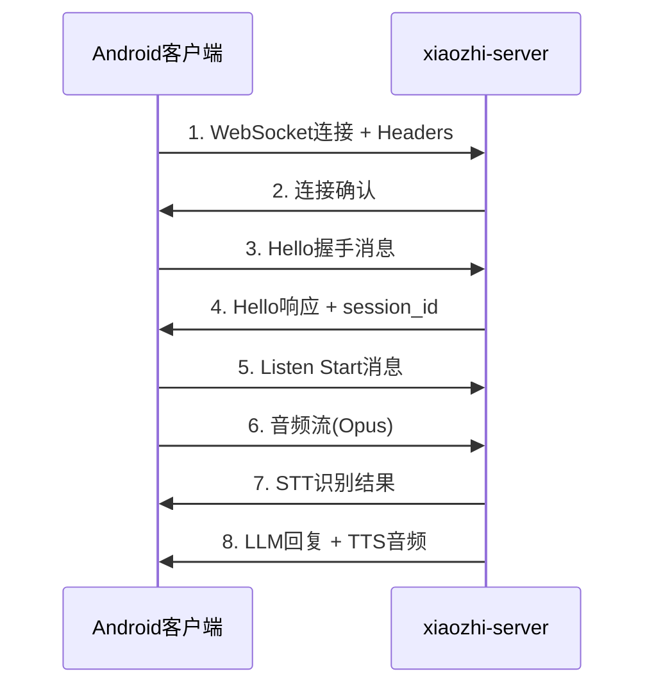

# WebSocket协议对接修复方案

## 🎯 问题现状确认

**远程服务器状态**: ✅ 正常运行  
**WebSocket地址**: `ws://47.122.144.73:8000/xiaozhi/v1/`  
**问题定位**: Android客户端与远程服务器的协议对接存在问题

## 🔍 协议分析

### 标准协议流程


## 🚨 当前问题分析

### 1. Hello握手阶段
**Android客户端发送**:
```json
{
  "type": "hello",
  "version": 1,
  "transport": "websocket", 
  "audio_params": {
    "format": "opus",
    "sample_rate": 16000,
    "channels": 1,
    "frame_duration": 60
  }
}
```

**服务器期望响应**:
```json
{
  "type": "hello",
  "session_id": "xxx-xxx-xxx",
  "transport": "websocket",
  "version": 1,
  "audio_params": {
    "format": "opus", 
    "sample_rate": 16000,
    "channels": 1,
    "frame_duration": 60
  }
}
```

### 2. Listen Start阶段
**Android客户端发送**:
```json
{
  "session_id": "xxx-xxx-xxx",
  "type": "listen",
  "state": "start",
  "mode": "auto"
}
```

**服务器处理**: 设置 `conn.client_have_voice = True`

### 3. 音频传输阶段
- **客户端**: 发送Opus编码的音频二进制数据(每60ms一帧)
- **服务器**: VAD检测 → ASR识别 → 返回STT结果

### 4. STT响应阶段
**服务器应返回**:
```json
{
  "type": "stt",
  "text": "识别的文本内容", 
  "session_id": "xxx-xxx-xxx"
}
```

## 🔧 具体修复方案

### Step 1: 验证WebSocket连接
测试基础连接是否正常：

```bash
# 使用curl测试HTTP端点
curl -I http://47.122.144.73:8000/xiaozhi/v1/

# 使用websocat测试WebSocket连接
echo '{"type":"hello","version":1,"transport":"websocket","audio_params":{"format":"opus","sample_rate":16000,"channels":1,"frame_duration":60}}' | websocat ws://47.122.144.73:8000/xiaozhi/v1/
```

### Step 2: 检查Hello握手过程

在Android代码中添加详细日志验证握手过程：

```kotlin
// WebsocketProtocol.kt - onMessage方法增强
override fun onMessage(webSocket: WebSocket, text: String) {
    Log.i(TAG, "=== 收到服务器消息 ===")
    Log.i(TAG, "原始消息: $text")
    
    scope.launch {
        try {
            val json = JSONObject(text)
            val type = json.optString("type")
            Log.i(TAG, "消息类型: $type")
            
            when (type) {
                "hello" -> {
                    Log.i(TAG, "✅ 收到Hello响应，开始解析...")
                    Log.i(TAG, "Hello详细内容: ${json.toString(2)}")
                    parseServerHello(json)
                }
                "stt" -> {
                    Log.i(TAG, "🎉 *** 收到STT响应! ***")
                    Log.i(TAG, "STT文本: ${json.optString("text")}")
                    incomingJsonFlow.emit(json)
                }
                else -> {
                    Log.i(TAG, "其他消息类型: $type")
                    incomingJsonFlow.emit(json)
                }
            }
        } catch (e: Exception) {
            Log.e(TAG, "❌ 消息解析失败", e)
            Log.e(TAG, "问题消息: $text")
        }
    }
}
```

### Step 3: 验证Listen Start确认机制

修改服务器端 `textHandle.py` 添加确认响应：

```python
elif msg_json["type"] == "listen":
    if msg_json["state"] == "start":
        conn.client_have_voice = True
        conn.client_voice_stop = False
        
        # 📍 添加Listen Start确认响应
        await conn.websocket.send(json.dumps({
            "type": "listen_ack",
            "state": "ready", 
            "session_id": conn.session_id,
            "timestamp": time.time()
        }))
        logger.bind(tag=TAG).info(f"已确认客户端开始监听，session: {conn.session_id}")
```

### Step 4: 音频流传输验证

在音频处理中添加调试信息：

```kotlin
// 音频发送时增加日志
override suspend fun sendAudio(data: ByteArray) {
    if (frameCount % 50 == 0) { // 每50帧打印一次，避免日志过多
        Log.d(TAG, "发送第${frameCount}帧音频，大小: ${data.size}字节")
    }
    frameCount++
    
    websocket?.run {
        send(ByteString.of(*data))
    } ?: Log.e(TAG, "WebSocket连接丢失，无法发送音频")
}
```

服务器端音频接收验证：

```python
# receiveAudioHandle.py - handleAudioMessage增强
async def handleAudioMessage(conn, audio):
    logger.bind(tag=TAG).debug(f"收到音频帧，大小: {len(audio)}字节")
    
    if not conn.asr_server_receive:
        logger.bind(tag=TAG).debug(f"ASR暂未准备，丢弃音频帧")
        return
        
    # ... 现有逻辑 ...
    
    if conn.client_voice_stop:
        logger.bind(tag=TAG).info(f"开始处理音频，总帧数: {len(conn.asr_audio)}")
        # ... ASR处理 ...
```

### Step 5: STT响应调试

确保STT响应格式正确：

```python
# sendAudioHandle.py - send_stt_message增强
async def send_stt_message(conn, text):
    """发送 STT 状态消息"""
    stt_text = get_string_no_punctuation_or_emoji(text)
    
    stt_message = {
        "type": "stt", 
        "text": stt_text, 
        "session_id": conn.session_id,
        "timestamp": time.time()
    }
    
    logger.bind(tag=TAG).info(f"📤 发送STT结果: {stt_text}")
    await conn.websocket.send(json.dumps(stt_message))
```

## 🧪 测试验证步骤

### 1. 基础连接测试
```bash
# 测试WebSocket端点可达性
curl -I http://47.122.144.73:8000

# 测试Hello握手
echo '{"type":"hello","version":1,"transport":"websocket"}' | websocat ws://47.122.144.73:8000/xiaozhi/v1/
```

### 2. Android客户端测试
1. 启动应用，观察连接日志
2. 确认Hello握手成功
3. 开始录音，观察音频发送日志  
4. 说话结束，等待STT响应

### 3. 服务器端验证
```bash
# 查看服务器实时日志
tail -f /path/to/xiaozhi-server/tmp/server.log | grep -E "(Hello|STT|音频|listen)"
```

## 🎯 预期修复结果

修复成功后的完整流程：

1. **连接阶段**: ✅ WebSocket连接成功
2. **握手阶段**: ✅ Hello消息往返正常
3. **监听阶段**: ✅ Listen Start得到确认
4. **音频阶段**: ✅ 音频流正常传输到服务器
5. **识别阶段**: ✅ VAD检测→ASR识别→STT响应
6. **显示阶段**: ✅ Android应用显示 `>> [识别内容]`

## 🚀 立即行动

1. **启用详细日志**: 在Android和服务器端都启用DEBUG级别日志
2. **测试基础连接**: 使用工具验证WebSocket连接可达性
3. **逐步验证**: 按Hello→Listen→Audio→STT顺序逐步验证每个环节
4. **实时监控**: 同时观察客户端和服务器端日志输出

这样就能快速定位并解决您的STT断点问题！ 